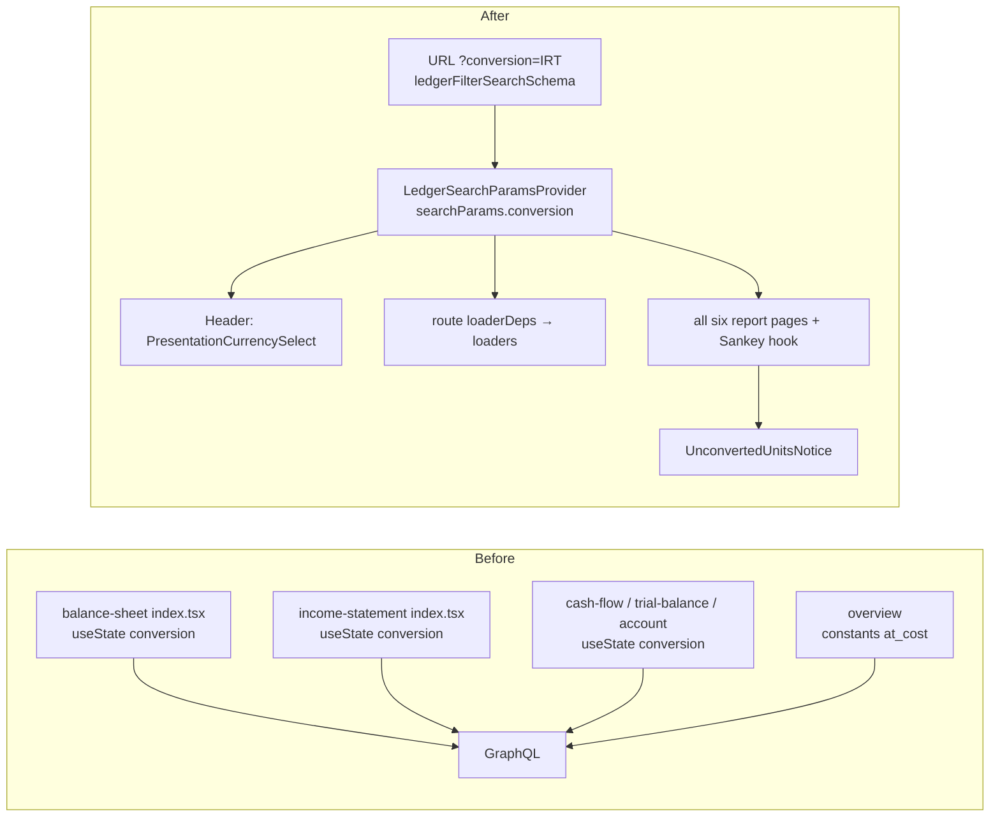

# Ledger-wide presentation currency

> **Run with:** `sonnet` / `high` effort — dashboard only, well-specified, but it rewires state
> ownership across six report pages, their SSR loaders, and the exports, with a router-level
> search param whose serialization has known pitfalls. Instruction for whoever launches
> `/plan-execute`.

## 1. Goal & scope

One ledger-wide **presentation currency** replaces five per-page conversion dropdowns. The user
picks a value once in the ledger header, next to the time/account/filter controls; it is stored
as a `conversion` URL search param, so it survives navigation, reload, SSR, and shared links.
Every report page and its loader read it from the router. With no selection (no param) every
amount shows in its own currency, exactly as today: the net worth card lists 1,100 USD,
-41,864,956 IRT, 19.953 TRX and so on. With a currency selected, each figure is one number in
that currency; amounts with no price path to it stay in their own unit and are disclosed under
the figure, never mixed into it.

**In scope:**
- `conversion` becomes the fourth shared ledger search param (schema, parse, loaderDeps, retention, ledger-switch reset).
- A `PresentationCurrencySelect` in `LedgerSearchControls`; the five `ConversionSelect` usages removed; `ConversionSelect` deleted.
- Overview (cards, charts, Sankey hook), balance sheet, income statement, cash flow, trial balance, account page read the param. Loaders pass it.
- Currency list = the ledger's `operating_currency` entries in declared order, read from `useLedger().ledgerData.options.operatingCurrency`; no new query.
- A shared unconverted-units disclosure on every report page when the conversion is a currency.
- Exports receive the presentation currency as their `primaryCurrency`.

**Out of scope:**
- Backend, REST, GraphQL, MCP — the `conversion` argument already accepts any currency code (`backend-cluster/ledger/src/foundation/rustledger/cost-valuation.ts:42-43`); no parity work.
- Budget page (`features/ledger-data/budget/index.tsx:95` pins `units` deliberately), holdings, commodities, journal — they do not take a conversion today.
- Offering non-operating commodities in the selector — requester decided operating currencies only; IRR is added via Settings plus one `price IRT 10 IRR` line.
- Per-user persistence outside the URL (localStorage, account settings).

## 2. Assumptions & open questions

**Blocking (resolve before approving):**
- The Sankey plan (`.claude/plans/2026-09-10-sankey-balanced-cash-flow.md`) is `approved` and mid-execution in another session: `use-sankey-statement.ts`, `docs/adrs/ADR004-…`, `reports/CLAUDE.md`, `overview/index.tsx` are uncommitted in the working tree. This plan edits the same files (C3, C4, D2). **Precondition:** the Sankey plan's Phases A–D are committed and its status is `done` before `/plan-execute` starts here. `/plan-execute` must refuse to run otherwise.

**Safe assumptions:**
- After that precondition, `useSankeyStatement(ledgerId, primaryCurrency, filters, accountMeta)` exists (`overview/hooks/use-sankey-statement.ts:41-46`) and `sankey-data-transformer.ts:84-88` collects `unshownUnits` for the caption.
- `useLedger().ledgerData.options.operatingCurrency` is the full declared list (`common/providers/ledger-provider/ledger-provider.tsx:17` takes `[0]` as `primaryCurrency`); the header can read it without a new query.
- A currency code in the URL that is not an operating currency (typo, old link, currency removed in Settings) falls back to the default silently; the schema keeps it a string so the server still values in it if a price path exists.
- `retainSearchParams` (`routes/ledger.$ledgerOwner.$ledgerName.tsx:15`) and the ledger switcher's reset (`common/components/ledger-layout/ledger-switcher.tsx:145`) extend to the fourth key with a one-line change each.

**Residual risks / unknowns for reviewer:**
- The default is unchanged (`at_cost`, own currencies), so existing users see identical numbers until they pick a currency. The requester first chose "default to first operating currency" and then reversed it on seeing the net worth card; the reversal is the recorded decision.
- `ConversionOption` (`common/types/chart.ts:8`) includes a literal `"USD"`; widening it to `"at_cost" | "at_value" | "units" | string` weakens exhaustiveness. The only branches on it are the export label if-chains at `export/markdown.ts:56-61` and `export/printable-statement.tsx:131-136`, whose final `else` already formats "Converted to {code}", so widening is safe; D2 names them.
- `LedgerSearchParams` is also the exports' `filters` type (`export/model.ts:54,275`, read by `csv.ts:51-53` and `markdown.ts:237-296`). D2 decides that `conversion` does not ride inside `filters` (exports already carry it as `context.conversion`, `model.ts:52`): the export type becomes `Pick<LedgerSearchParams, "account" | "filter" | "time">`.

**Bookkeeping:** no `CONTEXT.md` in this repo; the term **presentation currency** (the currency a report is valued in, distinct from the ledger's first operating currency `primaryCurrency`) is recorded in `dashboard/src/features/reports/CLAUDE.md` by task D2. Prior ADRs constraining this plan: `docs/adrs/ADR004-dashboard-sankey-cash-flow-projection.md` (never sum across units; disclose unconverted units).

## 3. Implementation tasks

### Phase A — Router owns `conversion`

- [x] **A1. Extend the shared search schema and parser** (TDD: write `parse.test.ts` cases first)
  - Files: `dashboard/src/common/lib/ledger-search-params/schema.ts`, `parse.ts`, `__tests__/parse.test.ts`, `dashboard/src/common/providers/ledger-search-params-provider/context.ts`
  - Change: add `conversion` to `LedgerSearchParams` (string, `""` = unset), to `ledgerFilterSearchSchema`, `parseLedgerFilterSearch`, `applyLedgerFilterSearch` (empty → `undefined`), `clearLedgerFilterSearch`. Normalize with `normalizeLedgerSearchValue` like the others; currency codes and the three keywords are plain strings, never numbers.
  - Tests: round-trips `at_cost`, `units`, `IRT`; empty drops the key; unknown values pass through unchanged.

- [x] **A2. Resolve the effective conversion in one place**
  - Files: `dashboard/src/common/lib/ledger-search-params/conversion.ts` (new), `common/types/chart.ts:8`
  - Change: `resolvePresentationConversion(raw, operatingCurrencies): ConversionOption`. Keywords and values present in `operatingCurrencies` pass through. Everything else, including `""` (no selection) and a stale or unknown code, returns `"at_cost"` = own currencies. This is the single fallback rule; D3 and §5 test and cite this same rule.
  - Widen `ConversionOption` to `"at_cost" | "at_value" | "units" | string`; add `isCurrencyConversion(value)`.
  - Why: requester's rule (2026-09-10): unselected = own currencies, selected = one number. One owner for default and fallback.

- [x] **A3. Retain and reset the new key with the others**
  - Files: `routes/ledger.$ledgerOwner.$ledgerName.tsx:15`, `common/components/ledger-layout/ledger-switcher.tsx:147-155`, `common/components/ledger-search-controls/index.tsx:96-106`
  - Change: add `"conversion"` to `retainSearchParams`. The switcher hand-writes `account/filter/time: undefined` in its `navigate` updater; add `conversion: undefined` there (or switch it to `clearLedgerFilterSearch`, which A1 extends). In the search controls, `handleClearAll` (`:96-102`) builds a literal `{account, filter, time}` and `hasActiveFilters` (`:104-106`) counts every key: both must exclude `conversion` — "Clear all" clears filters, not the view setting.
  - Tests: `ledger-switcher.test.tsx` (stale currency dropped on ledger switch), search-controls test (clear-all keeps `conversion`).

### Phase B — Header control

- [x] **B1. `PresentationCurrencySelect` in the header controls**
  - Files: `dashboard/src/common/components/ledger-search-controls/index.tsx`, `common/components/ledger-search-controls/presentation-currency-select.tsx` (new), locale files `i18n/locales/common/*.ts` (all 15)
  - Change: options in order — "Own currencies" (`at_cost`, written as no param), one "Converted to {currency}" per `ledgerData.options.operatingCurrency`, then a separator with "At market value" and "Units" for holders of priced lots.
  - Reads `searchParams.conversion` through `resolvePresentationConversion`; writes via `setSearchParams`. Rendered in both `inline` and `stack` layouts (`ledger-search-controls/index.tsx:73-108`).
  - Locale: reuse the five `component.conversionSelect.*` keys (`i18n/locales/common/en.ts:626-646`); add one label key for the control and one for "Own currencies" in `i18n/locales/common/` (15 files).
  - The `activeFilterCount` badge in `layout-header.tsx:76-78` must not count `conversion` — it is a view setting, not a filter.

- [x] **B2. Remove the per-page selectors**
  - Files: `features/reports/balance-sheet/balance-sheet-content.tsx:202`, `income-statement/income-statement-content.tsx:247`, `cash-flow/cash-flow-content.tsx:239`, `trial-balance/trial-balance-content.tsx:190`, `account/index.tsx:411`; delete `common/components/conversion-select.tsx` and its test.
  - Change: drop the `<ConversionSelect>` and its `onConversionChange`-style props; content components keep receiving `conversion` for display/exports. Knip must be green after the deletion.

### Phase C — Pages and loaders read the param

- [x] **C1. Report pages drop local conversion state**
  - Files: `features/reports/{balance-sheet,income-statement,cash-flow,trial-balance}/index.tsx` (`useState<ConversionOption>` at `:46`, `:47`, `:55`, `:42`), `features/reports/account/index.tsx:318`
  - Change: `const conversion = resolvePresentationConversion(ledgerFilters.searchParams.conversion, ledgerData.options.operatingCurrency)`; pass it to the query and content exactly where the state value went. Delete the `conversion` entry from each `constants.ts` query-defaults object once no caller remains.

- [x] **C2. Loaders pass the resolved conversion**
  - Files: `features/reports/{balance-sheet,income-statement,cash-flow,trial-balance,overview}/loader.ts`; `loaderDeps` in the balance-sheet, income-statement, cash-flow, trial-balance and index (overview) routes (already `ledgerFilterLoaderDeps(search)`, which A1 extends). The account page has no loader.
  - Change: loaders resolve the conversion with the same function as the pages. Operating currencies come from `await context.client.query({ query: GetLedgerDocument, variables: { ledgerId } })` — the existing loader idiom, served from cache because the parent route already awaited it (`routes/ledger.$ledgerOwner.$ledgerName.tsx:24-27`; `options.operatingCurrency` is selected at `graphql/query/ledger.graphql:119`). Do not introduce `readQuery`; it has no loader precedent.
  - Why: loader and page must produce identical query variables or the page refetches on mount and SSR content flashes.

- [x] **C3. Overview follows the same param**
  - Files: `features/reports/overview/index.tsx:86,93`, `overview/constants.ts`, `overview/hooks/use-sankey-statement.ts:41-50`
  - Change: overview query uses the resolved conversion instead of `overviewQueryDefaults.conversion`; `useSankeyStatement` takes `conversion: ConversionOption` and a `presentationCurrency: string` (the currency whose amounts are drawn) instead of `primaryCurrency`. When the conversion is a keyword (`at_cost`, `at_value`, `units`), the Sankey draws `primaryCurrency` amounts and discloses the rest, as today.

- [x] **C4. Net worth and account balance cards show one number under a currency**
  - Files: `overview/components/net-worth-card.tsx:49-58`, `overview/components/account-balances-card.tsx:34-39`, `overview/lib/overview-utils.ts:149-168,203-225`, `overview/index.tsx`
  - Change: both cards already take `primaryCurrency` and pick a headline through `prioritizeCurrency`/`getComparableAmount` and `buildAccountBalanceRows({ preferredCurrency })`. Pass the presentation currency instead when `isCurrencyConversion(conversion)`; otherwise keep `primaryCurrency`.
  - Under a currency: one headline amount; residual units (e.g. `19.953 TRX`) render as one muted line beneath, never as peer headlines. Under `at_cost`/`units`/`at_value`: the current multi-line list stays. The net-worth chart plots the presentation-currency series only.
  - `formatted-amounts.tsx` is a plain list renderer; the headline/residual split is made in the cards via `overview-utils.ts`, not there.

### Phase D — Disclosure and exports

- [x] **D1. Shared unconverted-units notice**
  - Files: `features/reports/export/units.ts` (new helper `collectUnits(records)`), `features/reports/components/unconverted-units-notice.tsx` (new), the five content components, `overview/index.tsx`
  - Change: when `isCurrencyConversion(conversion)` and the page payload contains units other than the target, render one muted notice: "Shown in {currency}. No price to {currency} for: {units}". Use the `ux-writing` skill for the copy.
  - Locale: the Sankey caption key `page.overview.cashFlowUnshownUnits` lives in `features/reports/overview/locales/*.ts`; move it to `features/reports/locales/*.ts` as `reports.unconvertedUnits` (15 files in that tree) and point the Sankey at the new key.
  - `hierarchy-list.tsx:78-98` already renders extra units as extra columns; keep that, the notice explains why they exist.

- [x] **D2. Exports and docs**
  - Files: `features/reports/export/model.ts:51-54,272-275`, `export/markdown.ts:56-61`, `export/printable-statement.tsx:131-136`, the content-component callers; `docs/adrs/ADR004-dashboard-sankey-cash-flow-projection.md:16-17`; `dashboard/src/features/reports/CLAUDE.md`
  - Change: when the conversion is a currency, exports receive it as `primaryCurrency` so column order, single-currency detection, and the multi-unit notice follow it. Narrow the export `filters` type to `Pick<LedgerSearchParams, "account" | "filter" | "time">` (see §2). The two label if-chains need no logic change; confirm their `else` branch prints the new codes.
  - ADR004 cites `use-sankey-statement.ts:50` as the conversion target; C3 moves that line — update the ADR's path:line in the same commit.
  - `reports/CLAUDE.md`: the `conversion` search param is router-owned; report pages never hold conversion in local state; default and fallback live in `resolvePresentationConversion`; "presentation currency" is the selected currency, `primaryCurrency` is the ledger's first operating currency.

- [x] **D3. Tests**
  - Files: `common/components/ledger-search-controls/__tests__/`, `common/components/ledger-layout/__tests__/layout-header.test.tsx:138`, `common/providers/ledger-search-params-provider/__tests__/` (`:137-233` navigation/history suite), page tests for balance sheet and overview
  - Cases: selector shows "Own currencies", every operating currency in order, then the two keywords; choosing IRT writes `?conversion=IRT` and survives Related Pages navigation and remount; an unknown or stale value resolves to `at_cost` (own currencies); switching ledgers clears it; "Clear all" keeps it; loader and page issue identical query variables (spy on `client.query`); the net worth card shows one headline plus a TRX residual line under `?conversion=USD`; the notice appears only under a currency conversion with residual units.

## 4. Definition of done

- [ ] `?conversion=` round-trips and defaults correctly — verify: `cd dashboard && yarn test src/common/lib/ledger-search-params src/common/providers/ledger-search-params-provider`.
- [ ] No report page holds conversion in local state — verify: `grep -rn "useState<ConversionOption>" dashboard/src` returns nothing.
- [ ] `ConversionSelect` is gone and Knip is clean — verify: `cd dashboard && yarn lint`.
- [ ] Loader and page share the cache key — verify: D3 spy test; manual: navigate to `/balance-sheet?conversion=IRT`, no second network request for the balance sheet in the browser network panel.
- [ ] Locale shape intact — verify: `cd dashboard && yarn test src/test/translations.test.ts`.
- [ ] Dashboard gate green — verify: `cd dashboard && yarn format:check && yarn lint && yarn test && yarn build`.
- [ ] Agent guidance check green — verify: `python3 scripts/check-agent-guidance.py`.
- [ ] Manual on `http://localhost:42600/ledger/vanenshi/ledgers`: with no selection the net worth card lists each currency on its own line as today; picking USD shows one USD headline with "not converted: 19.953 TRX" beneath; the Sankey and account rows follow; reload keeps USD; choosing "Own currencies" removes the param; switching ledger drops it.

## 5. Risk & rollback

| Risk | Severity | Mitigation |
|---|---|---|
| Residual unpriced units shown as peer headlines would defeat the "one number" goal | med | C4 puts residuals in one muted line under the headline; D3 tests the net worth card with a TRX residual |
| Loader/page cache-key mismatch causes SSR flash and double fetch | med | C2 resolves through the same function and the same operating-currency source; D3 spy test |
| Widened `ConversionOption` hides a missed branch in a `switch` | low | §2 grep; type stays a union with three literals for autocomplete |
| `retainSearchParams` copies a stale currency into a ledger that lacks it | low | A3 switcher reset drops it; if it survives, A2 resolves it to own currencies; test in D3 |
| This plan edits files the in-flight Sankey plan is still writing | high | §2 precondition: Sankey plan committed and `done` first; `/plan-execute` refuses otherwise |
| Header gets crowded on `lg` widths | low | Selector is compact (`size="sm"`), moves into the Filters sheet below `lg` like the others |

- **Rollback:** revert the dashboard commit. No backend, schema, or data change.

## 6. Skills Needed

- `superpowers:test-driven-development` (global) — for: A1, D3 — why: schema and resolver rules are pure functions; tests first.
- `superpowers:verification-before-completion` (global) — for: §4 — why: run the full dashboard gate and paste output.
- `ux-writing` (global) — for: B1, D1 — why: selector label and the disclosure sentence are user-facing copy.

## 7. ADR (invariant bullets — /plan-execute commits the file)

No ADR needed. The two rules this change creates have better homes: "never sum across units, disclose the remainder" is already `docs/adrs/ADR004-dashboard-sankey-cash-flow-projection.md`; "conversion is router-owned, pages never hold it in local state, default/fallback live in `resolvePresentationConversion`" is a convention for the reports feature and lands in `dashboard/src/features/reports/CLAUDE.md` (task D2), which every agent reads before touching that folder.

## Execution log

All 13 tasks (A1–A3, B1–B2, C1–C4, D1–D3) landed as planned; no divergence required
pausing for a design decision. No ADR needed, per §7 — the two rules this change creates
live in ADR004 (already existing) and `dashboard/src/features/reports/CLAUDE.md` (D2).

**Files changed (by phase):**

- **A1–A3** (router owns `conversion`): `common/lib/ledger-search-params/{schema,parse}.ts`,
  `conversion.ts` (new), `providers/ledger-search-params-provider/context.ts`,
  `routes/ledger.$ledgerOwner.$ledgerName.tsx`, `common/components/ledger-layout/ledger-switcher.tsx`,
  `common/components/ledger-search-controls/index.tsx`, `common/types/chart.ts`, plus tests.
- **B1–B2** (header control): `common/components/ledger-search-controls/presentation-currency-select.tsx`
  (new), `index.tsx`, `common/components/ledger-layout/layout-header.tsx`, 15 locale files under
  `i18n/locales/common/`; deleted `common/components/conversion-select.tsx` and its test, and the
  five per-page `<ConversionSelect>` usages in balance-sheet/income-statement/cash-flow/trial-balance/account.
- **C1–C3** (pages, loaders, Sankey): `features/reports/{balance-sheet,income-statement,cash-flow,
  trial-balance}/index.tsx` and `loader.ts`, `features/reports/account/index.tsx`,
  `overview/index.tsx`, `overview/hooks/use-sankey-statement.ts`, each report's `constants.ts`.
- **C4** (net worth / account balance cards): `overview/lib/overview-utils.ts` (new
  `splitPresentationAmounts`), `overview/components/{net-worth-card,account-balances-card}.tsx`,
  15 overview locale files (`notConvertedUnits` key), plus removal of the stray unused
  `component.conversionSelect.placeholder` key from 15 `i18n/locales/common/*.ts` files.
- **D1** (shared disclosure): `features/reports/export/units.ts` (new), `components/
  unconverted-units-notice.tsx` (new), wired into cash-flow/income-statement/balance-sheet/
  trial-balance/account/overview content components; 15 `reports/locales/*.ts` files
  (`reports.unconvertedUnits`); removed the overview-local `cashFlowUnshownUnits` key (renamed);
  `cash-flow-sankey.tsx` now reads the shared key; plus lint fixes surfaced by the new code
  (`layout-header.tsx`, `ledger-search-controls/index.tsx` rest-sibling discards;
  `presentation-currency-select.tsx`'s `toWrittenConversion` moved to `conversion.ts` for
  `react-refresh/only-export-components`).
- **D2** (exports/docs): `export/model.ts` (`filters` narrowed to `Pick<...,"account"|"filter"|
  "time">`), `balance-sheet-content.tsx`/`income-statement-content.tsx`/`cash-flow-content.tsx`
  (export `primaryCurrency` now follows the resolved presentation currency), `docs/adrs/
  ADR004-dashboard-sankey-cash-flow-projection.md` (line-18 citation fix), `features/reports/
  CLAUDE.md` (new "Presentation Currency" section).
- **D3** (tests): `balance-sheet/__tests__/{index,loader}.test.ts(x)` (new — loader/page
  conversion-resolution parity), `overview/__tests__/loader.test.ts` (added IRT parity case),
  `common/components/ledger-search-controls/__tests__/presentation-currency-select.test.tsx`
  (selector order, with a local jsdom pointer-capture polyfill for Radix `Select`),
  `common/providers/ledger-search-params-provider/__tests__/filter-navigation.test.tsx`
  (IRT round-trip across Related Pages nav/remount; ledger-switch now also asserts `conversion`
  clears). Cases for "unknown/stale → at_cost", "Clear all keeps it", the net worth card's
  headline+residual, and the notice's gating were already covered by A2/B1/C4/D1's own tests.

**Verify (§4 Definition of Done):**

- `yarn test src/common/lib/ledger-search-params src/common/providers/ledger-search-params-provider` — 3 files, 29 tests, all passed.
- `grep -rn "useState<ConversionOption>" dashboard/src` — no matches.
- `yarn lint` — clean (route generation, tsc, ESLint, Knip all green).
- D3 spy tests (`balance-sheet/__tests__/loader.test.ts` + `index.test.tsx`, `overview/__tests__/loader.test.ts`) — loader and page resolve the identical `conversion` value for the same URL input. Manual network-panel check (no second network request) not performed — see below.
- `yarn test src/test/translations.test.ts` — 14 tests passed.
- `yarn format:check && yarn lint && yarn test && yarn build` — all green (test: 326 files / 3699 passed, 1 skipped; build: succeeded).
- `python3 scripts/check-agent-guidance.py` — OK.
- Manual browser walkthrough at `http://localhost:42600/ledger/vanenshi/ledgers` — **not completed**: the running instance requires sign-in and no credentials were available in this session (entering credentials is outside what this agent does). This item needs a human pass before considering the visual behavior fully confirmed, though it is covered at the unit/component level by the D3 tests (net worth card headline+residual, notice gating, selector order/URL round-trip).

**Divergences:** none design-affecting. Two pre-existing lint errors (rest-sibling discards) and
one `react-refresh/only-export-components` violation were fixed inline during D1 as mechanical
cleanup of code introduced earlier in this same plan's execution (not scope creep — the files
were already touched by A3/B1). A `git stash` RED/GREEN technique was used twice (C4, and
previously) to force genuine test failure when the implementation was already in the working file.
