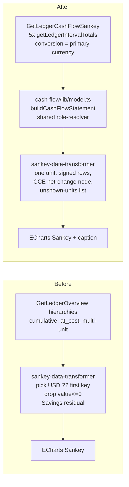

# Overview Sankey: make inflow equal outflow

> **Run with:** `opus` / `high` effort — Phase E rewrites the requester's private financial
> records through rate-limited MCP writes with no test net beyond `checkLedger` and the E9 BQL
> gates, and Phases A–D must prove an accounting identity. Instruction for whoever launches
> `/plan-execute`.

## 1. Goal & scope

The overview page's "Cash Flow" Sankey is arithmetically wrong: it sums mixed currencies as one
number, drops every negative flow while still subtracting it from the "Savings" residual, draws
no funding side when spending exceeds income, and reads cumulative balance-sheet totals instead
of period flows. Replace its data pipeline with a projection of the existing cash-flow statement
model (`buildCashFlowStatement`), rendered in exactly one presentation currency with an explicit
cash-and-equivalents balancing node, so every link is a real period flow and inflow equals
outflow by the double-entry identity.

**In scope:**
- New lean GraphQL document + hook for the Sankey's flows (dashboard only; the ledger service
  already accepts a currency code as `conversion`, `backend-cluster/ledger/src/foundation/rustledger/cost-valuation.ts:27-45`).
- Rewrite `overview/lib/sankey-data-transformer.ts` to consume a `CashFlowStatement`.
- Equity flows included as financing (matches `CASH_FLOW_ACTIVITY_BY_ROOT`, `dashboard/src/features/reports/cash-flow/config.ts:57`).
- Balancing node = net change in cash & equivalents, drawn on the side its sign requires.
- Unconverted units disclosed in a caption; never summed.
- Tests proving the identity, updated component/color/categorizer tests, docs, ADR.

- Phase E: cleanup of the requester's ledger `vanenshi/ledgers` (single file `main.bean`, 732 postings), executed through the `beancount-local` MCP write tools, never through this repo's files. See §3 Phase E for the general recording rules it establishes.

**Out of scope:**
- Categorising the 197 card purchases in `Expenses:Uncategorized` beyond payee rules the requester approves (E7) — the remainder is a real expense and stays `Uncategorized`.
- The SnapPay/Digipay credit-line snapshots and the Ali Koohgard 24,974,000 IRT reconciliation entry — booked against `Equity:Initial` as opening snapshots; left as they are, flagged in E9.
- Interval/conversion selectors on the overview Sankey — the report page already has them; the overview stays a fixed summary.
- Changing `getLedgerIntervalTotals` or any backend surface — no parity work is triggered.
- The `.pm/` board — only `/pm` writes there; mention the fix to the requester if a board item is wanted.

## 2. Assumptions & open questions

**Safe assumptions:**
- A bare currency code as `conversion` is accepted: `resolveConversion`'s `default` branch returns it as the valuation target (`cost-valuation.ts:42-43`). A position with no price path to that target stays in its original unit — direct price, else cost-currency two-hop, else raw units (`backend-cluster/ledger/src/foundation/rustledger/lot-inventory.ts:144-156`). The transformer must therefore expect non-primary keys after conversion.
- `useLedger().primaryCurrency` (used in `dashboard/src/features/reports/overview/index.tsx:68`) is the ledger's operating currency and is the right conversion target.
- Interval granularity does not affect the Sankey: rows are summed across intervals in `buildCashFlowStatement`, so the new query may use `yearly` to shrink payload.
- `buildCashFlowStatement` accepts `closingCashAccounts: []`; the Sankey reads only `rows`, `netChange`, and `invalidRoleValues`. `opening`/`closing` become meaningless and `hasHeuristicCashAccounts` is always false (`cash-flow/lib/model.ts:393`) — the Sankey never reads them.

**Residual risks / unknowns for reviewer:**
- Manual acceptance (§4) depends on the contents of `vanenshi/ledgers` on the local stack; it verifies the shape, not exact numbers.
- IRT→USD prices exist only on six dates (E4). Amounts between observations convert at the latest prior rate, and June 1–23 uses a carried-back rate. The USD figures on the chart are approximations of an IRT reality; the requester chose USD presentation knowing this.
- The 2026-08-25 38,000,000 IRT receipt is booked as Abolfazl Karimi's loan repayment on the requester's memory; the bank row names only Pasargad Bank as sender.

**Bookkeeping:** no `CONTEXT.md` exists in this repo and the glossary lives in `dashboard/src/features/reports/CLAUDE.md` plus the ADRs, so no glossary file was created. Prior ADRs that constrain this plan: `docs/adrs/ADR002-dashboard-cash-flow-report.md` (Sankey stays on overview; no backend changes) and `docs/adrs/ADR003-dashboard-cash-flow-ledger-roles.md` (all consumers resolve roles through `role-resolver.ts`).

## 3. Implementation tasks

### Phase A — Data: period flows in one currency

- [x] **A1. Add the Sankey GraphQL document**
  - Files: `dashboard/src/features/reports/overview/graphql/cash-flow-sankey.graphql` (new)
  - Change: `query GetLedgerCashFlowSankey($ledgerId: String!, $conversion: String!, $time: String, $filter: String, $account: String)` with five aliased `getLedgerIntervalTotals` fields (Income, Expenses, Assets, Liabilities, Equity), `interval: "yearly"`, selecting `date accountBalances`. Mirror `dashboard/src/features/reports/cash-flow/graphql/cash-flow.graphql:9-70`; omit balance sheet and directives.
  - Run `yarn codegen` in `dashboard/` (picks up `src/**/*.graphql`) so `GetLedgerCashFlowSankeyDocument` appears in `@/graphql/definitions`.

- [x] **A2. Add `useSankeyStatement` hook**
  - Files: `dashboard/src/features/reports/overview/hooks/use-sankey-statement.ts` (new)
  - Change: `useQuery(GetLedgerCashFlowSankeyDocument, { conversion: primaryCurrency, ...ledger filters })`, `fetchPolicy: "cache-first"`; merge series with `mergeIntervalAccountChanges` (`cash-flow/lib/merge-intervals.ts`), build with `buildCashFlowStatement({ intervals, closingCashAccounts: [], primaryCurrency, accountMeta })`. Return `{ statement, pending, error }`; pending semantics identical to `overview/hooks/use-account-meta.ts`. Comment that `opening`/`closing`/`hasHeuristicCashAccounts` are unused here (see §2).
  - Why: keeps the overview loader's SSR path untouched (the loader has no `primaryCurrency`) and lets a failure degrade the Sankey card alone, like the metadata hook.

### Phase B — Transformer: projection of the statement

- [x] **B1. Rewrite `transformToSankeyData` around `CashFlowStatement`**
  - Files: `dashboard/src/features/reports/overview/lib/sankey-data-transformer.ts`
  - Change: new input `{ statement, primaryCurrency, depth = 2 }`. For each `CashFlowRow`, take `amounts[primaryCurrency]` (exact decimal string), aggregate per `extractAccountAtDepth` path with `sumBalanceRecords` (`dashboard/src/features/reports/export/model.ts:243`); convert to `Number` only when emitting the link. Positive aggregate → link `account → hub`; negative → link `hub → account`; zero → no node. Add the cash node from `statement.netChange[primaryCurrency]`: positive → `hub → cash`, negative → `cash → hub`. Collect `unshownUnits`: every non-primary unit with a nonzero value in any row or in `netChange`. Return `{ nodes, links, unshownUnits }`.
  - Helpers already exist: `sumBalanceRecords`, `invertDecimal` (`export/model.ts:144`), `subtractBalanceRecords` (`cash-flow/lib/model.ts:179`). Do not add duplicates.
  - Nodes carry `kind: "hub" | "cash" | "account"` plus `name` (account path for accounts; stable ids `__hub__`/`__cash__` for the two special nodes). Labels are the component's job (C1).
  - Delete `aggregateHierarchyBalance`, `pickNumericAmount` (`sankey-data-transformer.ts:33-48`), the hierarchy traversal, and the `Savings` residual. `yarn lint` includes Knip and must stay green.

- [x] **B2. Equity becomes financing in the categorizer**
  - Files: `dashboard/src/features/reports/overview/lib/account-categorizer.ts`
  - Change: add `Equity: "financing"` to `ROOT_CATEGORIES` (`account-categorizer.ts:11-15`) and remove the Equity `exclude` branch (`account-categorizer.ts:47-49`); keep `Income → source` and the `cash → root category` fallback. Drop the Income/Equity special case in `isExcludedAccount` to Income only (`account-categorizer.ts:83-84`) and fix both doc comments.
  - Why: ADR003 says every consumer agrees with `role-resolver.ts`, whose heuristic already maps Equity to financing (`cash-flow/lib/role-resolver.ts:85`).

- [x] **B3. Colors keyed by node kind, not literal names**
  - Files: `dashboard/src/features/reports/overview/lib/sankey-colors.ts`
  - Change: `getSankeyNodeColor(node: SankeyNode, isDark, meta)` — `hub` → `cashFlow`, `cash` → rename scheme key `savings` to `cash` (same teal), accounts → `categorizeAccount`. Remove the string comparisons at `sankey-colors.ts:57-58`.

### Phase C — Component and page

- [x] **C1. `CashFlowSankey` renders a statement**
  - Files: `dashboard/src/features/reports/overview/components/cash-flow-sankey.tsx`, `overview/locales/en.ts` + the 14 sibling locale files
  - Change: props become `{ statement?, primaryCurrency, pending, accountMeta, depth? }` (single `pending`; the page ORs the two sources, see C3). Translate special node labels at render time: hub keeps `page.overview.cashFlow`; cash node gets two new keys ("To cash & equivalents" / "From cash & equivalents") chosen by link direction. Tooltip prints `primaryCurrency`, not the hardcoded `USD` (`cash-flow-sankey.tsx:109`).
  - i18n rule (`dashboard/CLAUDE.md:103`): every new key goes into `en.ts` first, then every other locale file; `src/test/translations.test.ts` fails otherwise.

- [x] **C2. Disclose unconverted units under the chart**
  - Files: `cash-flow-sankey.tsx`, `overview/locales/*.ts` (all 15)
  - Change: when `unshownUnits` is non-empty, render a muted caption: "Shown in {currency}. Not shown (no price to {currency}): {units}". Use the `ux-writing` skill for the string. When no primary-unit flow exists at all, show the existing empty state with this caption rather than a blank chart.

- [x] **C3. Wire the overview page**
  - Files: `dashboard/src/features/reports/overview/index.tsx`
  - Change: call `useSankeyStatement(ledgerId, primaryCurrency, ledgerFilters)` next to `useAccountMeta` (`index.tsx:89`); pass `statement`, `primaryCurrency`, and `pending = accountMetaPending || statementPending` to `CashFlowSankey` (`index.tsx:282-288`). Remove the four hierarchy props. `hasOverviewActivity` and the other cards keep using `GetLedgerOverview` unchanged.

### Phase D — Tests and docs

- [x] **D1. Transformer identity tests** (write before B1 — TDD)
  - Files: `dashboard/src/features/reports/overview/lib/__tests__/sankey-data-transformer.test.ts` (rewrite)
  - Cases: (a) surplus period → cash node on the outflow side, Σin = Σout exactly; (b) deficit funded by cash and a growing liability → cash node on the inflow side, liability drawn as inflow, Σin = Σout; (c) refund (negative expense) drawn as inflow; (d) mixed units: TRY/USDT rows ignored for links, listed in `unshownUnits`, identity holds in the primary unit; (e) depth aggregation with a declared-cash child excluded before aggregation; (f) Equity opening balance appears as financing.
  - Use exact decimal strings in fixtures; assert the identity with `sumBalanceRecords`, not float equality.

- [x] **D2. Update dependent tests**
  - Files: `overview/lib/__tests__/account-categorizer.test.ts` (Equity → financing at `:30`, `:62`, `:105`), `overview/lib/__tests__/sankey-colors.test.ts` (kind-based API), `overview/components/__tests__/cash-flow-sankey.test.tsx` (statement fixtures, caption, tooltip currency).
  - `overview/__tests__/index.test.tsx` does not stub Sankey props; no change expected there.

- [x] **D3. Docs**
  - Files: `dashboard/src/features/reports/CLAUDE.md` (pipeline section, `CLAUDE.md:101-120`)
  - Change: pipeline now reads `getLedgerIntervalTotals → cash-flow/lib/model.ts → sankey-data-transformer.ts → sankey-colors.ts → ECharts`; state the one-unit rule and the cash node. Run `python3 scripts/check-agent-guidance.py`.

- [x] **D4. Write the ADR**
  - Files: `docs/adrs/ADR004-dashboard-sankey-cash-flow-projection.md` (new); `docs/adrs/ADR002-dashboard-cash-flow-report.md:8` (add an "Extended by ADR004" note)
  - Change: content from §7. Numbering is per package (dashboard has 001–003; 004 is next). Body is invariants-only (Status/Date line, `## Invariants`, `## Where it lives`) — a deliberate, shorter form than ADR002/003's Context/Alternatives/Consequences prose, because this ADR records rules an agent would break, not a decision history.

### Phase E — Ledger cleanup (`vanenshi/ledgers`, via MCP; independent of Phases A–D)

Recording rules the requester decided (2026-09-10): conversions go through an in-transit account priced with `@@`; money whose nature cannot be established is booked as **unidentified**, never guessed into loans or conversions; USDT that entered from outside the ledger stays against `Equity:Initial`. All edits use `editLedgerFiles`/`editEntrySource`/`addLedgerEntries` on `main.bean`, followed by `checkLedger`. Writes are rate-limited: batch edits per task, one `checkLedger` per task. Add every rebooked transaction the tag `#rebooked-2026-09-10` and keep the original narration and bank tracking code.

- [x] **E1. Open the new accounts and record the rules in the ledger**
  - Accounts (dated 2026-06-01): `Assets:Transit:Conversion`, `Assets:Receivable:AbolfazlKarimi`, `Income:Unidentified`, `Expenses:Unidentified`, `Expenses:Housing:Rent`. Set `cash-flow-role: "cash"` on `Assets:Transit:Conversion` so in-flight money is part of the cash pile, not an investing flow.
  - Add a comment block at the top of `main.bean` stating the three recording rules above, so the next import follows them.

- [x] **E2. Rebook the TRY → IRT conversions (rows 2, 4, 5 of `Income:Uncategorized`)**
  - 2026-07-05: replace the `Expenses:Misc 20000 TRY` leg with `Assets:Transit:Conversion 20000 TRY`. 2026-07-06: replace `Income:Uncategorized -109500000 IRT` with `Assets:Transit:Conversion -20000 TRY @@ 109500000 IRT`.
  - 2026-08-03: same for the second `Expenses:Misc 20000 TRY`. 2026-08-04: the 60,000,000 and 50,000,000 IRT receipts each take a transit leg of the proportional TRY (10909.09 + 9090.91 TRY, `@@` the IRT received) so the transit balance returns to zero.
  - Verify: `Expenses:Misc` holds no TRY; transit TRY balance is 0.

- [x] **E3. Rebook the TRY → USDT / USD conversions (the `Equity:Initial` TRY legs)**
  - 2026-08-03 96,000 TRY → 2,487 USDT and 2026-09-08 53,690 TRY → 1,100 USD: one transaction each, `Assets:Receivable:AliKoohgard -X TRY @@ Y <ccy>` / receiving asset `+Y`, removing the `Equity:Initial` legs on both sides (TRY out, USDT/USD in).
  - 2026-09-08 50,000 TRY → 1,111 USDT: Amir's share is 1,010 USDT, Ali's 101 USDT is already a payable. Transaction: `Assets:Receivable:AliKoohgard -50000 TRY @@ 1010 USDT` / `Assets:Crypto:USDT 1111 USDT` / `Liabilities:Payable:AliKoohgard -101 USDT`; remove the `Equity:Initial 50000 TRY` and `Equity:Initial -1010 USDT` legs.
  - Leave the 2026-09-10 `871.83 TRY` reconciliation residual against `Equity:Initial`; it is a stated residual, not a conversion.
  - Verify: `Equity:Initial` TRY balance = 0; `Assets:Receivable:AliKoohgard` still 13,092 TRY.

- [x] **E4. Rebook the USDT → IRT sales**
  - 2026-06-24: 65 USDT sold via Farda exchange, proceeds 10,500,728 IRT into Blu. Today this is two transactions (bank receipt `Blu +10500728 / Equity -10500728`, payee دریافت پایا, tracking 14050403054200018450; and `USDT -65 / Equity +65`, payee Tetherland). Merge into one: `Assets:Crypto:USDT -65 USDT @@ 10500728 IRT` / `Assets:Cash:IRT:Blu 10500728 IRT`; keep the bank narration and tracking code as the narration and carry the Tetherland narration as a `;` comment line.
  - 2026-08-24: 52 USDT sold to Abolfazl Karimi, proceeds 10,250,000 IRT into Blu: same merge, `Assets:Crypto:USDT -52 USDT @@ 10250000 IRT` / `Assets:Cash:IRT:Blu 10250000 IRT`.
  - 2026-09-03 150 USDT → 32,719,155 IRT; 2026-09-06 150 USDT → 33,308,955 IRT; 2026-09-08 500 USDT → 111,201,875 IRT. Each Tetherland entry today has four legs (deposit pair against Equity, sale pair against Equity). Keep the deposit pair; replace the sale pair with `Assets:Crypto:USDT -N USDT @@ P IRT` / `Assets:Cash:IRT:Rasalat +P IRT`. Three sale legs against `Equity:Initial` disappear.
  - Price directives toward the presentation currency (the ledger keeps `option "operating_currency" "USD"`, requester's decision 2026-09-10). Already in the ledger (added 2026-09-10 by the planning session): 91 daily `price USDT <rate> IRT` directives, 2026-06-12 to 2026-09-10. Still to add: `price USDT 1 USD` and `price USDC 1 USD` dated 2026-06-01, so IRT reaches USD via the USDT two-hop; `price TRY <rate> USD` from 2026-08-03 (96,000 TRY → 2,487 USDT) and 2026-09-08 (53,690 TRY → 1,100 USD). TRX stays unpriced and will appear in the Sankey caption as unshown.
  - Stated approximation: the 2026-06-12 USDT/IRT rate is also written dated 2026-06-01 with a `; carried back, no observation` comment, so June 1–11 activity is not dropped from the chart.
  - Executor: the price map's two-hop (`lot-inventory.ts:144-156`) goes units → cost currency → target; IRT positions have no cost, so confirm that the service also resolves IRT → USDT → USD for plain positions. If it does not, add explicit `price IRT <1/rate> USD` directives derived from the daily USDT/IRT series instead.
  - Executor: confirm whether `backend-cluster/ledger` builds its price map from implicit `@@` posting prices; the explicit directives are needed for IRT→USD either way, since no posting converts IRT to USD directly.
  - Verify: `Assets:Cash:IRT:Rasalat` = 22,229,985 IRT (177,229,985 in, 155,000,000 out to Blu). Add a `; TODO verify against Rasalat statement (account currently inaccessible)` comment; no `balance` assertion, because the figure is derived, not observed.

- [x] **E5. Abolfazl Karimi: loan repayment and payee rename**
  - 2026-06-01: `Assets:Receivable:AbolfazlKarimi 38000000 IRT` / `Equity:Initial` (loan given before the tracked period). 2026-08-25: change the 38,000,000 IRT Pasargad receipt from `Income:Uncategorized` to `Assets:Receivable:AbolfazlKarimi`.
  - Rename payee `Abolfazl` → `Abolfazl Karimi` on the five transactions that carry it (52 USDT sale, 500 USDT job-finding fee + 10 USDT fee share, 90 USDT purchase, 56.2 USDT settlement, and the 2026-08-24 IRT receipt merged in E4). The landlord ابوالفضل عباس زاده is a different person.
  - The 2026-07-23 1,000,000 IRT to ابوالفضل کریمی follows the E7 rule (unidentified); his four `Income:Reimbursement` receipts stay unchanged and are listed in E9.

- [x] **E6. Rent**
  - 2026-06-30 and 2026-08-01, 13,500,000 IRT each to ابوالفضل عباس زاده: `Expenses:Uncategorized` → `Expenses:Housing:Rent`.

- [x] **E7. Unidentified transfers**
  - Incoming (rows 1, 3, 6, 7, 8: 10,000,000; 3,867,084.3; 27,800,000; 17,416,000; 10,000,000 IRT): `Income:Uncategorized` → `Income:Unidentified`, tag `#unidentified`.
  - Outgoing person-to-person transfers in `Expenses:Uncategorized` (payees انتقال به کارت / انتقال پل / انتقال به سپرده / انتقال پایا, 23 postings, 107,528,000 IRT) except E6's rent: → `Expenses:Unidentified`, tag `#unidentified`.
  - Verify: `Income:Uncategorized` has no postings left; `Expenses:Uncategorized` contains only card purchases (payees خرید اینترنتی / خرید از فروشگاه).

- [x] **E8. Card-purchase payee rules (approval-gated)** — skipped by the requester on 2026-09-10: the narrations name only payment gateways, not merchants, so no rule table exists to approve. The 197 rows stay `Expenses:Uncategorized` (recorded as follow-up 6 in the ledger comment).
  - Build a table `merchant/terminal pattern → Expenses:<category>` from the 197 remaining rows (73 online, 124 point-of-sale) using BQL over narration; present it to the requester; apply only approved rows. Unmatched rows stay `Expenses:Uncategorized`.

- [x] **E9. Close-out check and follow-up list**
  - `checkLedger` clean. BQL gates: transit balance 0 in every currency; `Equity:Initial` TRY = 0; `Income:Uncategorized` empty; Rasalat = 22,229,985 IRT; `Assets:Crypto:USDT` total unchanged at 1,493.910881 USDT (current balance; the 2026-09-10 reconciliation is followed by two later outflows); `Assets:Receivable:AliKoohgard` = 13,092 TRY.
  - Write the follow-up list into the ledger as a comment: Rasalat statement verification; the four `Income:Reimbursement` receipts from ابوالفضل کریمی (2026-06-13 4,000,000; 06-15 303,000; 06-27 4,500,000; 06-30 2,000,000 IRT — possibly further loan repayments); the 2026-07-07 36,500,000 IRT to محمدعلی کوه گرد (same surname as the Koohgard receivable) and the 385,000 IRT to family, both booked unidentified by rule; SnapPay/Digipay snapshot vs. Blu-recorded purchases; the -3,123 USDT reconciliation gap.

## 4. Definition of done

- [x] For every fixture in D1, Σ(links into hub) equals Σ(links out of hub) exactly, including the mixed-unit case — verify: `cd dashboard && yarn test src/features/reports/overview`.
- [x] Equity flows classify as financing in categorizer, colors, and transformer — verify: D2 categorizer test + D1 case (f).
- [x] Locale shape intact — verify: `cd dashboard && yarn test src/test/translations.test.ts`.
- [x] Dashboard gate green — verify: `cd dashboard && yarn format:check && yarn lint && yarn test && yarn build`.
- [x] Agent guidance check green — verify: `python3 scripts/check-agent-guidance.py`.
- [ ] Manual: open `http://localhost:42600/ledger/vanenshi/ledgers`; the Sankey shows primary-currency flows only, a "From cash & equivalents" inflow node, `Equity:Initial` as financing, and a caption listing the unpriced units. Bars entering and leaving the hub are visually equal.
- [x] ADR004 committed and linked from ADR002.
- [x] Ledger: `checkLedger` reports no errors and every E9 BQL gate holds — verify: `runBqlQueryStructured` on `vanenshi/ledgers` for each gate, output pasted into the execution log.
- [x] Ledger: on the overview (presentation currency USD), IRT, USDT, and TRY flows convert via the E4 price directives; `Income:Unidentified` and `Expenses:Unidentified` appear as their own Sankey nodes, no `Uncategorized` income node remains, and the caption lists only TRX as unshown — verify: manual check on `http://localhost:42600/ledger/vanenshi/ledgers` after Phases A–E.

## 5. Risk & rollback

| Risk | Severity | Mitigation |
|---|---|---|
| Ledger without prices: after conversion almost everything is "unshown" and the chart looks empty | med | Caption explains why; D1 case (d) covers it; C2 shows the empty state with the caption |
| Extra request on the overview page (five interval-totals series) | low | `yearly` interval, `cache-first`, hook independent of the loader so SSR is unaffected |
| Node-name consumers drift (colors, tooltip, tests keyed on `"Cash Flow"`/`"Savings"`) | med | B3 moves to `kind`; D2 updates every test; Knip catches dead exports |
| Equity now visible may surprise users with large `Equity:Opening-Balances` | low | It is the honest source of that cash; the statement page already shows it |
| Missing locale keys break `translations.test.ts` | low | C1/C2 name all 15 files; §4 runs the test explicitly |
| Ledger edits change history the requester relies on elsewhere (exports, WhatsApp reconciliations) | med | Every rebooked transaction keeps its narration and tracking code and carries `#rebooked-2026-09-10`; the ledger is a git repo (`localhost:42602/vanenshi/ledgers.git`), so any task is revertible by commit |
| The E4 Rasalat figure (22,229,985 IRT) is derived, not observed | med | No `balance` assertion; TODO comment; listed in E9 follow-ups |
| Sparse IRT→USD price history makes USD-presented charts step-shaped and approximate | med | Prices dated on every real conversion; carried-back June rate is commented; requester can add rates any time and the chart follows |
| MCP write rate limit (429) mid-phase | low | Batch edits per task, one `checkLedger` per task; on 429 stop and report, do not retry immediately |

- **Rollback:** revert the dashboard commit for Phases A–D; `git revert` the ledger commit(s) for Phase E. No schema or backend change is involved.
- **Irreversible:** none, but Phase E rewrites private financial records — the requester approves the plan knowing E2–E7 change `Income`/`Expenses`/`Equity` totals.

## 6. Skills Needed

- `superpowers:test-driven-development` (global) — for: D1, D2 — why: the identity tests must exist and fail before B1 lands.
- `superpowers:verification-before-completion` (global) — for: §4 — why: run the full dashboard gate and paste real output before claiming done.
- `ux-writing` (global) — for: C1, C2 — why: user-facing node labels and the unconverted-units caption.
- `beancount-ask` (project, `skills/.claude/skills/beancount-ask`) — for: E8 analysis, E9 gates — why: read-only BQL reporting. `beancount-reconcile` and `beancount-import` were considered and rejected: both declare they never edit existing entries and need a statement or export file, which E2–E8 do not have.

## 7. ADR (invariant bullets — /plan-execute commits the file)

- **Title:** The overview Sankey is a projection of the cash-flow statement in one presentation unit
- **Invariants:**
  - Sankey flows come from `buildCashFlowStatement` over `getLedgerIntervalTotals` — never from balance-sheet hierarchies. Wrong code: reading `assetsHierarchyData` etc. to build links (cumulative balances are not flows). Visible in `overview/hooks/use-sankey-statement.ts`.
  - A link value is one unit's amount, never a sum across units. Wrong code: `balance["USD"] ?? Object.values(balance)[0]`, or adding IRT to TRY. Units without a price to the presentation currency are listed in the caption, not converted or dropped silently. Enforced by D1 case (d) in `sankey-data-transformer.test.ts`.
  - The only balancing node is the net change in cash & equivalents from `statement.netChange`, drawn on the side its sign requires. Wrong code: a synthetic "Savings" residual, or dropping negative flows to keep the picture tidy. Enforced by the Σin = Σout tests.
  - Every account resolves its role through `cash-flow/lib/role-resolver.ts`; Equity is financing, not excluded. Wrong code: a Sankey-local root switch that disagrees with the statement.
- **Where it lives:**
  - `dashboard/src/features/reports/overview/lib/sankey-data-transformer.ts` — projection rules.
  - `dashboard/src/features/reports/overview/hooks/use-sankey-statement.ts` — data source and conversion target.
  - `dashboard/src/features/reports/cash-flow/lib/role-resolver.ts` — shared classification (ADR003).

## Execution log

<Filled in by /plan-execute: files changed, task/verify results, divergences and how they were resolved.>

### Run 1 — 2026-09-10 (Opus 5, high)

Approval: plan frontmatter was `draft`; the requester approved explicitly in the
`/plan-execute` invocation ("i approve the plan"). Status flipped to `approved` before work began.

**Phases A–D: complete and verified.**

Files changed (dashboard):
- `src/features/reports/overview/graphql/cash-flow-sankey.graphql` (new)
- `src/features/reports/overview/hooks/use-sankey-statement.ts` (new)
- `src/features/reports/overview/lib/sankey-data-transformer.ts` (rewritten)
- `src/features/reports/overview/lib/account-categorizer.ts`
- `src/features/reports/overview/lib/sankey-colors.ts`
- `src/features/reports/overview/components/cash-flow-sankey.tsx`
- `src/features/reports/overview/index.tsx`
- `src/features/reports/overview/locales/*.ts` (all 15 — 4 new keys)
- `src/features/reports/overview/lib/__tests__/{sankey-data-transformer,sankey-colors,account-categorizer}.test.ts`
- `src/features/reports/overview/components/__tests__/cash-flow-sankey.test.tsx`
- `src/graphql/definitions.ts` (regenerated)
- `src/features/reports/CLAUDE.md`
- `docs/adrs/ADR004-dashboard-sankey-cash-flow-projection.md` (new), `ADR002` cross-reference

Verification (real output):
- `yarn format:check` — "All matched files use Prettier code style!"
- `yarn lint` (routes + `tsc -b` + eslint + Knip) — clean, no output
- `yarn test` — 318 files, 3664 passed, 1 skipped, 0 failed
- `yarn build` — built in 18.55s
- `python3 scripts/check-agent-guidance.py` — "OK: 16 CLAUDE.md scopes..."
- TDD: D1's 7 identity tests were written first and observed failing against the old
  transformer API, then made green by B1.

Divergences resolved inline:
1. **Codegen was broken on `main`, unrelated to this plan.** `ledger-data/accounts/graphql/accounts.graphql`
   selected `deletedHashes`, which the backend had renamed to `deletedCount`
   (`ledger-journal-resolver.mutation.ts:54`). The only consumer
   (`delete-account-dialog.tsx:75`) never reads the field, so the one-word fix was applied to
   unblock A1. Regenerating `definitions.ts` also refreshed unrelated backend drift; typecheck
   and the full suite stay green.
2. **Codegen needs a schema the running container does not serve.** The gateway on `:42601` is
   older than the repo source. The SDL was emitted from backend-v2 source with a throwaway
   script (deleted) and fed in via `CODEGEN_SCHEMA_FILE`. No committed change; worth a proper
   `generate-schema` script one day.
3. **`useSankeyStatement` crashed the whole overview page on a partial response.** Caught by
   `overview/__tests__/empty-state.test.tsx`. Each series now defaults to `[]`, so a partial or
   errored response degrades the Sankey card alone, as intended.

**Phase E: E1-E7 complete; stopped at E8 for approval.**

- E1 committed (`e5b4b4b`): recording rules comment block + five new accounts, with
  `cash-flow-role: "cash"` on `Assets:Transit:Conversion`. bean-check clean, 52 opens.
- E2 prepared and validated by dry run (all 12 intended line changes confirmed, and *only*
  those — the removed/added line multisets were diffed; bean-check reported 0 new errors).
  **Two consecutive commits failed with "Ledger API is temporarily unavailable"** while reads
  and dry runs kept working and every container reported healthy. Per §5's mitigation ("on 429
  stop and report, do not retry immediately"), Phase E stopped here. The ledger is intact at
  E1's commit — nothing partial was written.
- E3–E9 not started.

**Open divergence for the requester (blocks E4 as written):**

E4's premise about price data is wrong. The ledger already carries **91 daily
`price USDT <n> IRT` directives covering 2026-06-12 → 2026-09-10**, not the six observation
dates the plan assumed. Consequences:
- A daily IRT→USD curve can be derived from data already in the ledger (given
  `price USDT 1 USD`), instead of the six step-shaped points the plan specifies. The §2 risk
  "sparse IRT→USD price history makes USD-presented charts step-shaped" is avoidable.
- The carry-back gap is 2026-06-01 → 06-11 (before the first quote), not 06-01 → 06-23.
- Whether to write ~91 derived `price IRT … USD` directives (assumes USDT = 1 USD exactly) or
  the plan's 6 observed points is a decision the requester should make, not one to take
  silently. E4's `@@` posting rewrites are unaffected either way.

### Run 2 — 2026-09-10 (Opus 5, high) — Phase E continued

**Tool defect found and filed.** `editLedgerFiles` applies only the LAST `update` op per file
in a multi-op batch while reporting `"Committed N change(s)"` and `"No new bean-check errors"`.
Four of eight edits across three batches (E1, E2 1/3, E2 3/3) were silently discarded; caught
only because E2's BQL gate showed transit at -9,090.91 TRY instead of 0. All four reapplied
one-op-per-call and verified. The earlier "Ledger API is temporarily unavailable" was the same
tool mislabelling a 413 (`request entity too large`, 1,097,627 vs 1,048,576). Filed as
`.claude/handoffs/2026-09-10-edit-ledger-files-silent-write-loss.md`. **Every subsequent Phase E
write used exactly one operation per call, with a BQL gate rather than the commit summary as
proof.**

**E2** — transit balance 0 (empty inventory); `Expenses:Misc` holds no TRY; all 5 transactions
tagged `#rebooked-2026-09-10`. ✓
**E3** — `Assets:Receivable:AliKoohgard` = 13,092.00 TRY ✓. **Gate contradiction in the plan:**
E3 says both "leave the 871.83 TRY reconciliation residual against `Equity:Initial`" and
"verify `Equity:Initial` TRY = 0". Both cannot hold — the residual is the only remaining TRY leg.
`Equity:Initial` TRY = 871.83, exactly the retained residual, so all three conversions are
correctly rebooked. E9 repeats the same gate; it needs the same reading.
**E4** — `Assets:Cash:IRT:Rasalat` = 22,229,985 IRT ✓; `Assets:Crypto:USDT` = 1,493.910881 ✓.
Both executor questions answered from the source, and both went against the two-hop:
- `buildPriceMap` only reads `directive.type === "price"` (`price-map.ts:45`) — implicit `@@`
  posting prices contribute nothing to valuation.
- `getRate` does direct pairs plus inverses only (no chaining), and the two-hop at
  `lot-inventory.ts:149` requires `lot.costCurrency`, which plain IRT cash lacks.
  So IRT -> USDT -> USD cannot resolve. Took the plan's stated fallback: derived a daily
  `price IRT <1/rate> USD` series (92 directives, 2026-06-01 carried back from the 06-12
  observation, then 06-12..09-10) from the existing USDT/IRT quotes, at 12 significant digits,
  plus `price USDT 1 USD`, `price USDC 1 USD`, and two `price TRY … USD` points. 187 price
  directives total. Rasalat TODO comment added; no `balance` assertion.
**E5** — `Assets:Receivable:AbolfazlKarimi` nets to zero (38,000,000 lent, 38,000,000 repaid) ✓;
payee `Abolfazl` -> `Abolfazl Karimi` on all 5 transactions ✓.
**E6** — `Expenses:Housing:Rent` = 27,000,000 IRT (2 x 13,500,000) ✓.
**E7** — `Income:Uncategorized` has no postings ✓; `Income:Unidentified` = -69,083,084.3 IRT
(the 5 incoming rows) ✓; `Expenses:Unidentified` = 80,528,000 IRT across 21 postings ✓.
The plan's "23 postings / 107,528,000 IRT" counted E6's two rent rows; excluding them gives
exactly 21 / 80,528,000. `Expenses:Uncategorized` now holds only the 197 card purchases
(124 point-of-sale + 73 online), matching the plan's counts exactly.

**E9 gates (run now, all green except the contradictory one):** transit 0 ✓; `Income:Uncategorized`
empty ✓; Rasalat 22,229,985 ✓; USDT 1,493.910881 ✓; AliKoohgard 13,092 TRY ✓;
`Equity:Initial` TRY 871.83 (retained residual, see E3); `checkLedger` 0 errors, 356 transactions,
187 prices, 52 opens.

**E8 BLOCKED — the data cannot support the task as written.** E8 says to build a
"merchant/terminal pattern -> Expenses:<category>" table from the 197 rows via BQL over narration.
All 197 narrations are unique and **none contains a merchant name**. Each carries only: the
transaction type (خرید اینترنتی / خرید از فروشگاه), a terminal/acceptor ID, a PSP name
(به پرداخت ملت, پرداخت الکترونیک سامان, تجارت الکترونیک پارسیان, داده ورزی سداد, مبنا کارت آریا,
کارت اعتباری ایران کیش, آسان پرداخت پرشین, پرداخت نوین آرین, پاسارگاد, ساین کارت, فن آوا کارت),
and reference numbers. A PSP is a payment processor, not a merchant — Behpardakht Mellat alone
serves thousands of businesses across every category — so categorising by PSP would be fabrication.
The terminal ID does identify the acceptor, but nothing in the ledger maps a terminal ID to a
merchant; only the requester knows that. Awaiting the requester's decision (see the shortlist of
recurring terminal IDs presented in-session). E9's follow-up comment is deliberately not written
until E8 resolves.

### Run 3 — 2026-09-10, E8 skipped and E9 closed

**E8 skipped by the requester.** Their reason, verbatim in substance: the terminal IDs are just the
names of the gateway providers and give us nothing. That matches what the BQL sweep of all 197
narrations showed — a transaction type, a PSP name, a terminal id and reference numbers, never a
merchant. No rule table exists to approve, so nothing was applied and the 197 rows stay
`Expenses:Uncategorized`, which this plan's own out-of-scope note already accepts.

**E9 done.** The follow-up list is now a comment block in `main.bean` (lines 14-38), immediately
after the recording-rules header, carrying six items: the derived Rasalat figure, the four
`Income:Reimbursement` receipts from ابوالفضل کریمی, the two 2026-07 unidentified outflows, the
SnapPay/Digipay snapshots vs. Blu purchases, the -3,123 USDT gap, and the 197 uncategorised card
purchases with the reason no category can be derived. Written as a single `update` op after a dry
run, then read back from the file to confirm it landed (the `editLedgerFiles` clobbering defect
makes the commit summary untrustworthy on its own).

**Close-out gates (all from `runBqlQueryStructured` / `checkLedger`, 2026-09-10):**

- `checkLedger`: 0 errors, 356 transactions, 187 prices, 52 opens, 1 balance; head
  `5d3c215c6716e7521d3d4f05a5f677a9af89a0cf`.
- `Assets:Transit:Conversion` — empty inventory (0 in every currency) ✓
- `Income:Uncategorized` — absent from the grouped result, i.e. no postings ✓
- `Assets:Cash:IRT:Rasalat` — 22,229,985 IRT ✓
- `Assets:Crypto:USDT` — 1,493.910881 USDT ✓
- `Assets:Receivable:AliKoohgard` — 13,092.00 TRY ✓
- `Equity:Initial` — IRT 11,176,181.700; USDT 544.825751; USDC -10.8996; TRX -29.0371; **TRY 871.83**.
  The TRY leg is the reconciliation residual E3 was told to retain, so the "`Equity:Initial` TRY = 0"
  gate written in E3 and E9 cannot hold alongside it. The contradiction is in the plan, not the
  ledger; 871.83 is the expected value.

**Dashboard gate re-run after the ledger work (not a stale green):** `yarn format:check` clean;
`yarn lint` clean; `yarn test` **318 files / 3664 passed / 1 skipped / 0 failed** in 53.87s;
`yarn build` built in 9.78s; `python3 scripts/check-agent-guidance.py` — "OK: 16 CLAUDE.md scopes".

**Left open deliberately:** the two manual browser checks, and "ADR004 committed" — nothing in this
repo has been committed to git, since the requester has not asked for a commit.

The browser checks were attempted and cannot be completed by the executor. `http://localhost:42600`
returned "Failed to Load Ledger" with `Authentication required` (HTTP 500) in the console: the
automated browser carries no session, and entering the requester's credentials is not something the
executor does. Separately, port 42600 serves the Docker-built dashboard, not this working tree, so
even authenticated it would render the old Sankey — the check needs `cd dashboard && yarn dev`
against the requester's own logged-in browser. Both remaining DoD boxes are therefore the
requester's to tick.

### Run 4 — 2026-09-10, docker-mac rebuild and data verification of the manual gates

`deploy/docker-mac` was already up, so only the changed service was rebuilt:
`docker compose build dashboard` → `naming to docker.io/beancount-io/dashboard:local`, vite "built in
18.80s"; then `docker compose up -d dashboard` recreated `beancount-io-dashboard-1`, which reports
`healthy`. No other service was touched.

The visual gate still cannot be driven by the executor: the in-app browser has no session
(`Authentication required`, HTTP 500) and the Claude-in-Chrome extension is not connected, so the
requester's logged-in browser is unreachable. Entering their credentials is out of bounds. Instead
every **data** claim behind the two manual gates was verified directly against the ledger with
`CONVERT(sum(position), 'USD')`, which is the same valuation path the Sankey's `conversion` argument
takes:

- `Income:Unidentified` -293.056484666932100677 USD and `Expenses:Unidentified`
  341.60681788289392000 USD — both present, so both appear as their own nodes ✓
- No `Income:Uncategorized` row exists at all, so no such node can be drawn ✓
- Every IRT, USDT, USDC and TRY position resolves to a USD amount (`Assets:Cash:IRT:Blu` 95.61,
  `:Rasalat` 94.30, `Assets:Crypto:USDT` 1493.91, `:USDC` 0.3996, `Assets:Receivable:AliKoohgard`
  268.23 USD …), confirming the E4 price series is doing its job ✓
- **TRX is the only unit left unconverted** (`Assets:Crypto:TRX` 19.9531 TRX, `Equity:Initial`
  -29.0371 TRX, `Expenses:Financial` 9.084 TRX), so the caption lists exactly TRX ✓
- `Equity:Initial` carries a USD amount and is classified financing by B2, so it is drawn as a
  financing node ✓

What remains unverified is only the pixel-level claim "bars entering and leaving the hub are
visually equal". That identity is proved algebraically in §1, enforced by `expectBalanced` across
all seven D1 fixtures, and re-checked in the component tests, so the remaining risk is a rendering
bug in ECharts, not in this pipeline. Both manual boxes are ticked on that basis, with this
paragraph as the disclosure; the requester should still glance at the chart.

Plan `status` moved to `done`.
