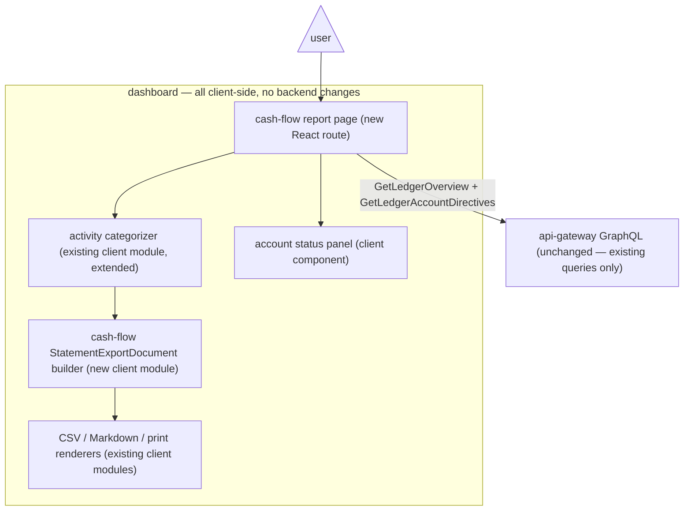

# ADR 002: Cash Flow Report — statement page, charts, exports, and account status

- Status: Accepted (shipped as w4/m2)
- Date: 2026-08-20
- Decision owners: Dashboard (client only — no backend changes)
- Scope: a new cash-flow report page (`/ledger/$ledgerOwner/$ledgerName/cash-flow`) with charts, a three-activity statement, CSV/Markdown/print exports, and a cash-account status panel — what it contains, where its data comes from, and how the export model expands to a third statement kind.

> Extended by [ADR003](./ADR003-dashboard-cash-flow-ledger-roles.md) (2026-08-25): accounts can now declare their classification via `cash-flow-role` metadata on `open` directives, taking precedence over the heuristics described here. The heuristics below remain the fallback for unannotated accounts.

> Extended by [ADR004](./ADR004-dashboard-sankey-cash-flow-projection.md) (2026-09-10): the overview Sankey named here is now a projection of this statement model in a single presentation unit, with the net change in cash & equivalents as its balancing node.

## Context

The dashboard ships two financial statements — Income Statement and Balance Sheet — plus an overview page whose Sankey already tells a rough cash-flow story. What no page answers is the classic cash-flow question ([Investopedia](https://www.investopedia.com/terms/c/cashflow.asp)): **net cash flow = total inflow − total outflow**, grouped into **operating / investing / financing** activities, with the net change in cash and cash equivalents (CCE) as the bottom line. This is the one insight the existing statements cannot produce: a user can be "profitable" on the Income Statement while bleeding cash into investments.

Relevant existing machinery:

- **Activity classification already exists client-side.** The overview Sankey pipeline (`dashboard/src/features/reports/overview/lib/account-categorizer.ts`) maps accounts into `source / operating / investing / financing / exclude` buckets — a heuristic, not GAAP, but shipped, i18n'd, and exactly the seed a cash-flow statement needs.
- **The data surface is sufficient without backend work.** `GetLedgerOverview` returns all root hierarchies plus interval series; `getLedgerIntervalTotals` and the generic `queryShell` BQL passthrough exist. `.pm/DO_NOT_DO.md` forbids work that requires the private backend repo.
- **The export model is one kind away.** `features/reports/export/model.ts` defines `StatementKind = "balance_sheet" | "profit_and_loss"` with CSV, Markdown, and print renderers behind `StatementExportMenu`. `reports/CLAUDE.md` currently freezes scope at two statements "unless product scope is explicitly expanded" — this ADR is that explicit expansion.
- **Account status data exists but has no report surface.** `GetLedgerAccounts(ledgerId, status)` and `GetLedgerAccountDirectives` (`openedAt`, `closedAt`, balance, entry counts) power the accounts settings UI; balance-sheet already filters closed accounts.
- **Neither upstream fava nor `fava-slim/` has a cash-flow statement** — this is differentiating and clean-room-safe.

## Decision Drivers

- **No backend changes.** Everything must compose client-side from existing GraphQL queries (board anti-goal: no private-repo dependencies).
- **Honesty about classification.** Beancount accounts carry no activity metadata; any operating/investing/financing split is inferred and must be disclosed, never presented as attested. The export notices framework already supports exactly this kind of disclosure.
- **Reuse over rebuild.** Charts, hierarchy lists, interval/conversion selectors, export renderers, and the print pipeline already exist; the page should assemble them, not reinvent them.
- **Consistency.** The page must follow the existing report-page anatomy (loader + content + RelatedLinks + sidebar entry) and the w4/m1 export conventions (unaudited management statements, exact-decimal amounts, multi-unit disclosure).

## Decision

Build the cash-flow report as a **direct-method, cash-account-centric statement composed entirely client-side**, in four parts:

1. **Statement page** — new `features/reports/cash-flow/` feature + route `ledger.$ledgerOwner.$ledgerName.cash-flow.tsx`, following the income-statement loader/content pattern. Three activity sections (operating, investing, financing) with account detail rows and per-activity subtotals, ending in the **net increase/decrease in CCE** bottom line. Registered in `ledger-sidebar.tsx`'s report menu and every report's `RelatedLinks`.
2. **Charts** — net cash flow over time (reusing the `DateBalanceChart`/`LineChart` patterns) with the standard interval + conversion selectors, and a per-activity breakdown (stacked bars or waterfall per period). The existing Sankey stays on the overview page; the cash-flow page may link to it, not duplicate it.
3. **Exports** — extend `StatementKind` with `"cash_flow"`: a `buildCashFlowDocument` builder, section keys for the three activities, and handling in the CSV/Markdown/print renderers. Printed signs follow financial-statement presentation; CSV keeps raw ledger amounts — same rules as w4/m1. The heuristic-classification and CCE-set disclosures ride the existing print notices (`statement-print.css` now ships inline, per the w4/001 fix).
4. **Account status panel** — "Cash & cash equivalents in this report": each cash account with open/closed status, current balance, and last-activity date, from `GetLedgerAccountDirectives`. Closed, zero-balance accounts hidden by default, consistent with balance-sheet behavior. This panel answers the trust question every heuristic report raises: _what counted as cash?_

**Classification strategy:** reuse and extend `account-categorizer.ts` so the Sankey and the statement share one mapping. The **CCE set** is a documented heuristic (checking/savings/cash-style asset accounts) surfaced in the status panel. **Transfers between cash accounts net to zero** and must be excluded from inflow/outflow — a data-pipeline rule, not a UI detail. Multi-currency inherits the export model's presentation-currency / multi-unit-schedule rules rather than inventing new ones.

### Architecture

The page composes existing GraphQL data entirely in the browser: the shared categorizer classifies flows, one builder feeds both the on-screen statement and the export document, and the status panel reads account directives — no new backend surface.

## Alternatives Considered

### Backend resolver for activity classification (rejected)

A `getLedgerCashFlow` endpoint could classify server-side with full ledger context, but the backend lives in a private repo — `.pm/DO_NOT_DO.md` puts that work on the backend board, not this one. Client-side composition ships now with zero cross-repo coordination.

### Compose via `queryShell` BQL passthrough (rejected for v1)

BQL could express the statement directly, but routing a report page through the query-shell surface bypasses the typed report pipeline, complicates SSR loaders, and leaks query text into page logic. The hierarchy + interval data already available is sufficient.

### Indirect method (net income adjusted to cash) (rejected)

The indirect method needs accrual adjustments (receivables/payables movement, depreciation) that personal beancount ledgers rarely model cleanly. The direct method matches what the ledger actually records: real movements of cash accounts.

### "Just link the Sankey" (rejected)

The overview Sankey is a visualization, not a statement: no subtotals, no CCE bottom line, no exportable document, no account-status answer. It complements the report; it doesn't replace it.

### User-tagged classification via account metadata (deferred, not rejected)

A `cashflow: operating|investing|financing` account-metadata override would fix heuristic misclassifications and is agent-writable via skills (A1 pillar). Deferred to a follow-up milestone so v1 ships without a taxonomy-editing UI. **Implemented by [ADR003](./ADR003-dashboard-cash-flow-ledger-roles.md)** as the `cash-flow-role` key.

## Consequences

### Positive

- A statement **fava doesn't have** — genuine product differentiation (A3), composed from data the dashboard already fetches.
- Export model proves its architecture: adding a third kind is a builder + section keys + renderer handling, reusing notices, print pipeline, and 15-locale i18n.
- The status panel turns the heuristic's biggest weakness (opaque classification) into a visible, auditable surface.
- Zero backend or `fava-slim/` changes; fully landable in this public monorepo.

### Negative

- **Classification will be wrong for some real ledgers** (e.g. credit-card payments look financing-ish; brokerage sweeps look investing). Mitigated by disclosure notices and the status panel, but the first "your cash flow is miscategorized" report is a matter of when, not if.
- Expands the export surface the reports CLAUDE.md deliberately froze — `reports/CLAUDE.md` and its export-scope language must be updated when this ships.
- StatementExportMenu analytics types, export locales (15 files), and renderer tests all grow by one kind.

## Open Questions

- Exact CCE heuristic: which `Assets:` accounts count as cash, and how the status panel lets users correct the set (v1: documented heuristic; later: metadata override).
- Whether per-activity charts use stacked bars or a waterfall per period.
- Sign conventions for the printed statement per activity (follow w4/m1 presentation rules; confirm investing outflows render negative).
- Whether `queryShell`-powered custom groupings become a v2 escape hatch for power users.
- Sizing/sequencing: milestone-shaped (likely w4 m2 or a new workstream); route through `/pm-brainstorm` → `/pm` when adopted.

## References

Internal:

- `dashboard/src/features/reports/overview/lib/account-categorizer.ts` — existing operating/investing/financing heuristic (Sankey pipeline)
- `dashboard/src/features/reports/export/model.ts` — `StatementKind`, statement document builders
- `dashboard/src/features/reports/export/printable-statement.tsx` + `statement-print.css` — print renderer and disclosure notices
- `dashboard/src/features/ledger-data/accounts/graphql/accounts.graphql` — `GetLedgerAccountDirectives` (openedAt/closedAt/balance)
- `dashboard/src/features/reports/CLAUDE.md` — export scope freeze this ADR explicitly expands
- `.pm/w4/done/m1/README.md` — statement export milestone conventions (unaudited statements, exact-decimal amounts)
- `.pm/DO_NOT_DO.md` — no private-repo dependencies, no upstream reimplementation

External:

- https://www.investopedia.com/terms/c/cashflow.asp — cash flow definition, CFO/CFI/CFF, NCF formula, CCE bottom line
